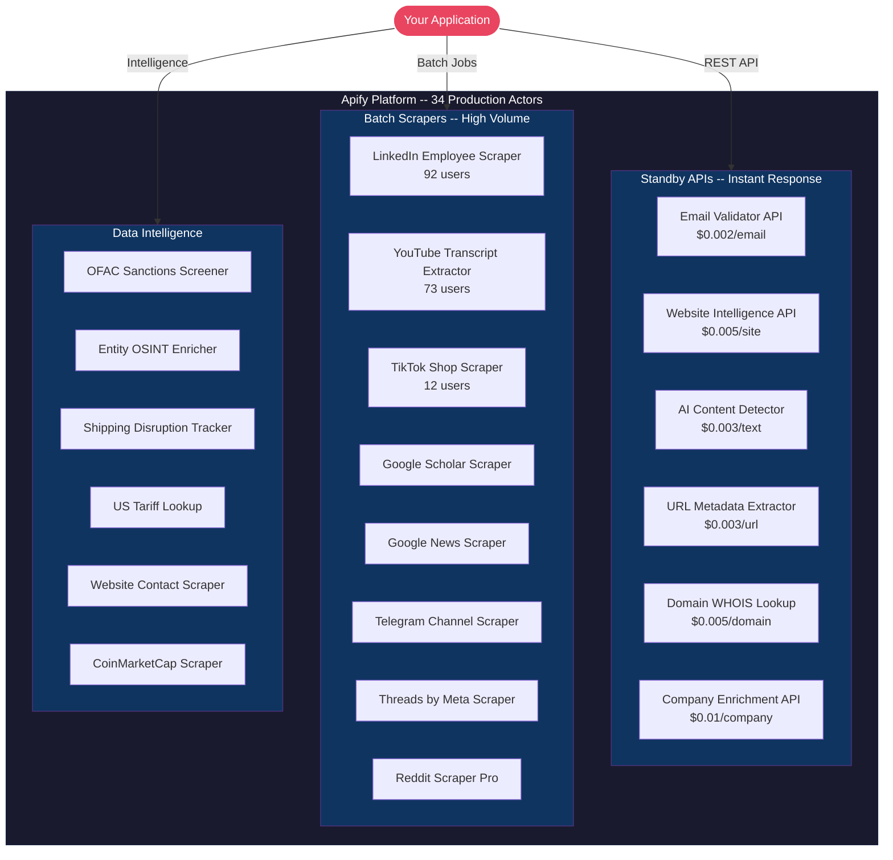

<h1 align="center">George The Developer</h1>
<p align="center">
  <strong>Building production-grade web scrapers & data APIs on <a href="https://apify.com/george.the.developer">Apify</a></strong>
</p>

<p align="center">
  
  
  
</p>

<p align="center">
  
  
  
  
  
  
</p>

---

## Portfolio Architecture



## Top Actors by Adoption

| Actor | Users | Runs | Category |
|-------|------:|-----:|----------|
| [LinkedIn Employee Scraper](https://apify.com/george.the.developer/linkedin-employee-scraper) | 92 | 623+ | Batch Scraper |
| [YouTube Transcript Extractor](https://apify.com/george.the.developer/youtube-transcript-extractor) | 73 | 327+ | Batch Scraper |
| [TikTok Shop Scraper](https://apify.com/george.the.developer/tiktok-shop-scraper) | 12 | 294+ | Batch Scraper |
| [Google News Scraper](https://apify.com/george.the.developer/google-news-scraper) | 4 | - | Batch Scraper |
| [Email Validator API](https://apify.com/george.the.developer/email-validator-api) | - | 200+ | Standby API |
| [CoinMarketCap Scraper](https://apify.com/george.the.developer/coinmarketcap-scraper) | - | 239+ | Data Intel |

## Standby APIs (Instant, Pay-Per-Event)

These actors run as always-on HTTP endpoints -- send a request, get data back in milliseconds:

- **[Email Validator API](https://apify.com/george.the.developer/email-validator-api)** -- MX, SMTP, disposable detection -- `$0.002/email`
- **[Website Intelligence API](https://apify.com/george.the.developer/website-intelligence-api)** -- Tech stack, DNS, SSL, performance -- `$0.005/site`
- **[AI Content Detector](https://apify.com/george.the.developer/ai-content-detector)** -- GPT/AI text detection -- `$0.003/text`
- **[URL Metadata Extractor](https://apify.com/george.the.developer/url-metadata-extractor)** -- Title, OG tags, screenshots -- `$0.003/url`
- **[Domain WHOIS Lookup](https://apify.com/george.the.developer/domain-whois-lookup)** -- Registration, expiry, nameservers -- `$0.005/domain`
- **[Company Enrichment API](https://apify.com/george.the.developer/company-enrichment-api)** -- Firmographics from company name -- `$0.01/company`

## What I Build

I specialize in **production-grade web scrapers and data APIs** that handle anti-bot protections, scale to millions of pages, and deliver clean structured data. Every actor includes:

- Automatic retries and proxy rotation
- Structured JSON/CSV output
- Pay-per-result pricing (you only pay for successful extractions)
- Full API access via Apify platform or direct HTTP

## Tech Stack

```
Runtime:     Node.js 22 + ESM modules
Frameworks:  Crawlee, Apify SDK
Browsers:    Puppeteer, Playwright
Languages:   JavaScript, Python
APIs:        REST, Standby (always-on HTTP)
Platform:    Apify Cloud
```

## Work With Me

Building a scraper, data pipeline, or automation? I deliver production-ready solutions:

- **Custom scrapers** for any website
- **Data APIs** with instant response times
- **Lead generation** pipelines
- **Market intelligence** dashboards

<p align="center">
  <a href="https://apify.com/george.the.developer"></a>
</p>

---

<p align="center">
  
</p>
