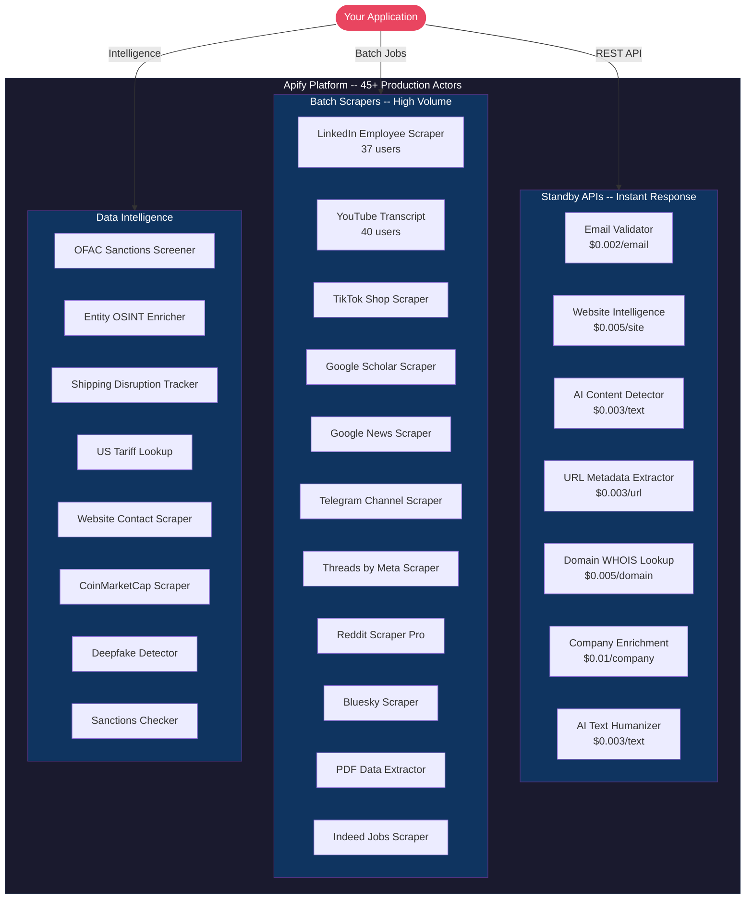

<h1 align="center">George Kioko</h1>
<p align="center">
  <strong>API Builder & Web Scraping Specialist from Nairobi, Kenya</strong><br/>
  <em>45+ production data APIs on <a href="https://apify.com/george.the.developer">Apify Store</a> | 10K+ runs | 500+ users</em>
</p>

<p align="center">
  <a href="https://apify.com/george.the.developer"></a>
  
  
</p>

<p align="center">
  <a href="https://x.com/ai_in_it"></a>
  <a href="https://apify.com/george.the.developer"></a>
</p>

<p align="center">
  
  
  
  
  
  
</p>

---

## What I Build

I build **production-grade web scrapers and data APIs** that handle anti-bot protections, scale to millions of pages, and return clean structured data. I've shipped 45+ actors on the Apify Store used by hundreds of developers and businesses worldwide.

Every tool I build includes automatic retries, proxy rotation, structured JSON/CSV output, and pay-per-result pricing -- you only pay for successful extractions.

---

## Portfolio Architecture



## Top Actors

| Actor | Users | Category |
|-------|------:|----------|
| [LinkedIn Employee Scraper](https://apify.com/george.the.developer/linkedin-employee-scraper) | 37 | Batch Scraper |
| [YouTube Transcript Extractor](https://apify.com/george.the.developer/youtube-transcript-extractor) | 40 | Batch Scraper |
| [Google News Scraper](https://apify.com/george.the.developer/google-news-scraper) | 4 | Batch Scraper |
| [Email Validator API](https://apify.com/george.the.developer/email-validator-api) | -- | Standby API |
| [AI Content Detector](https://apify.com/george.the.developer/ai-content-detector) | -- | Standby API |
| [Google Scholar Scraper](https://apify.com/george.the.developer/google-scholar-scraper) | -- | Batch Scraper |

## Standby APIs (Instant, Pay-Per-Event)

Always-on HTTP endpoints -- send a request, get data back in milliseconds:

- **[Email Validator API](https://apify.com/george.the.developer/email-validator-api)** -- MX, SMTP, disposable detection -- `$0.002/email`
- **[Website Intelligence API](https://apify.com/george.the.developer/website-intelligence-api)** -- Tech stack, DNS, SSL, performance -- `$0.005/site`
- **[AI Content Detector](https://apify.com/george.the.developer/ai-content-detector)** -- GPT/AI text detection -- `$0.003/text`
- **[AI Text Humanizer](https://apify.com/george.the.developer/ai-text-humanizer-api)** -- Rewrite AI text to sound human -- `$0.003/text`
- **[URL Metadata Extractor](https://apify.com/george.the.developer/url-metadata-extractor)** -- Title, OG tags, screenshots -- `$0.003/url`
- **[Domain WHOIS Lookup](https://apify.com/george.the.developer/domain-whois-lookup)** -- Registration, expiry, nameservers -- `$0.005/domain`
- **[Company Enrichment API](https://apify.com/george.the.developer/company-enrichment-api)** -- Firmographics from company name -- `$0.01/company`

## Tech Stack

```
Runtime:     Node.js 22 + ESM modules
Frameworks:  Crawlee, Apify SDK
Browsers:    Puppeteer, Playwright
Languages:   JavaScript, Python
APIs:        REST, Standby (always-on HTTP)
Platform:    Apify Cloud
```

## Work With Me

Need a custom scraper, data pipeline, or automation? I deliver production-ready solutions:

- **Custom scrapers** for any website
- **Data APIs** with instant response times
- **Lead generation** pipelines
- **Market intelligence** dashboards

<p align="center">
  <a href="https://apify.com/george.the.developer"></a>
  <a href="https://x.com/ai_in_it"></a>
</p>

---

<p align="center">
  
</p>
